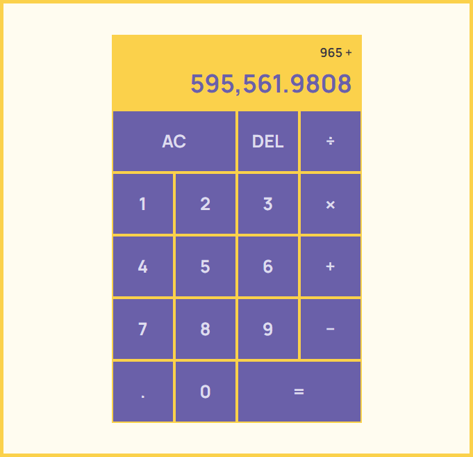

# :1234: CalcJs - A JavaScript (ES6+) Calculator

This is a very basic JavaScript calculator using Class syntax of JavaScript(EcmaScript 6+).

All the four basic operations(:heavy_plus_sign:, :heavy_multiplication_x:, :heavy_minus_sign:, :heavy_division_sign:) are supported.

Take a look on the screenshot.

