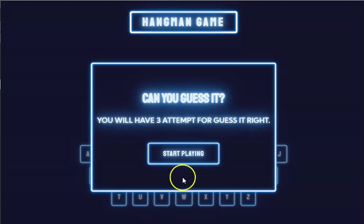

# 👹 Hangman Glow

The popular Hangman Game built with JavaScript using `class` syntax and `fetch()` API. The glowing effect is the result of using `text-shadow` and `box-shadow` property.
For generating random words, I used the [random-word-api](https://random-word-api.herokuapp.com/word).

:pushpin: Rules for the hangman game play can be found [here](<https://en.wikipedia.org/wiki/Hangman_(game)>).

## App Preview 😍

### 👉 [Live Link](https://hangmanglow.netlify.app/)

