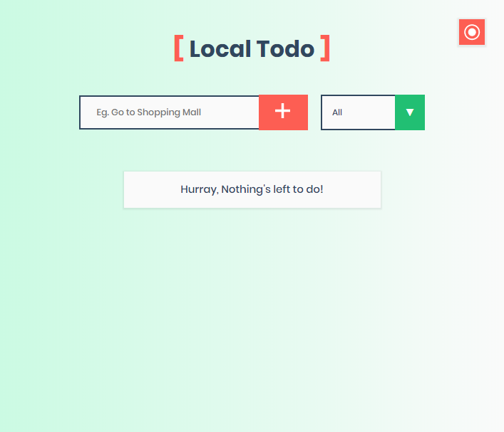
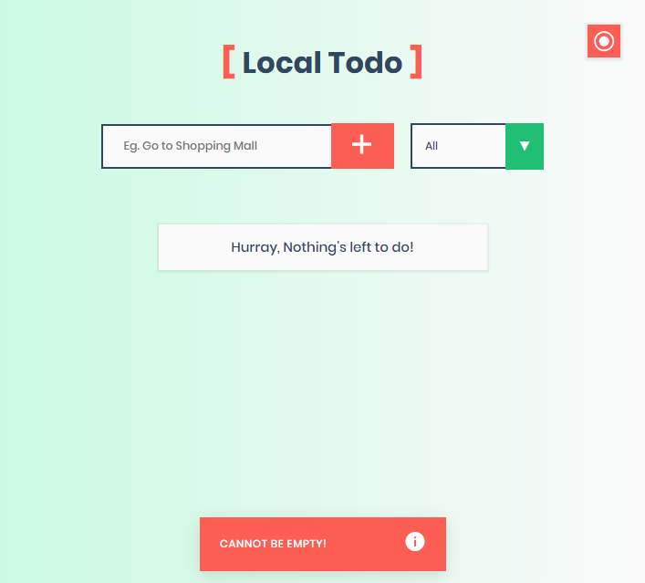
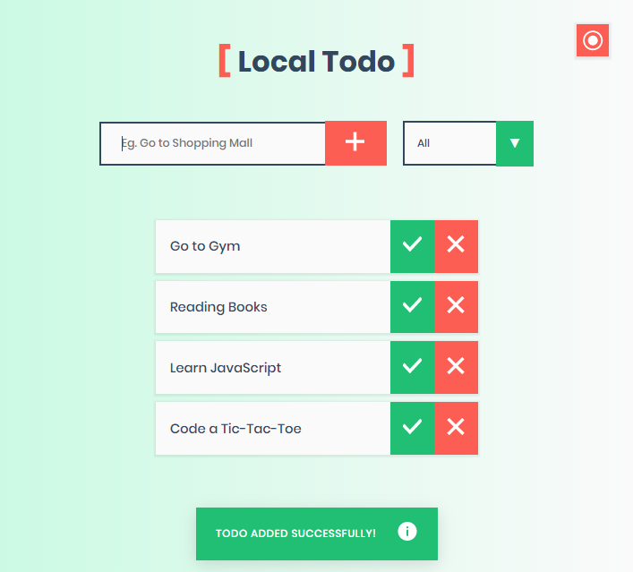
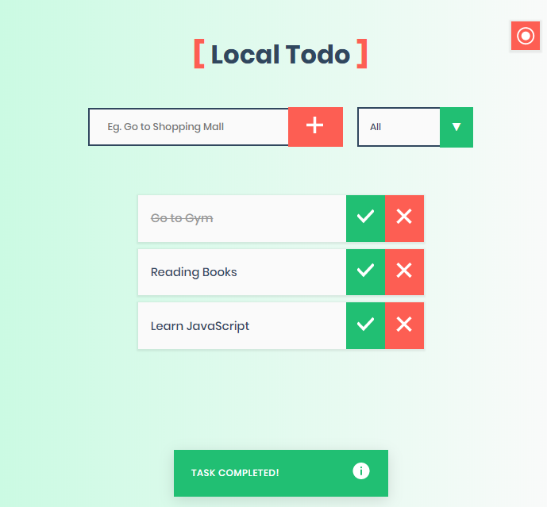
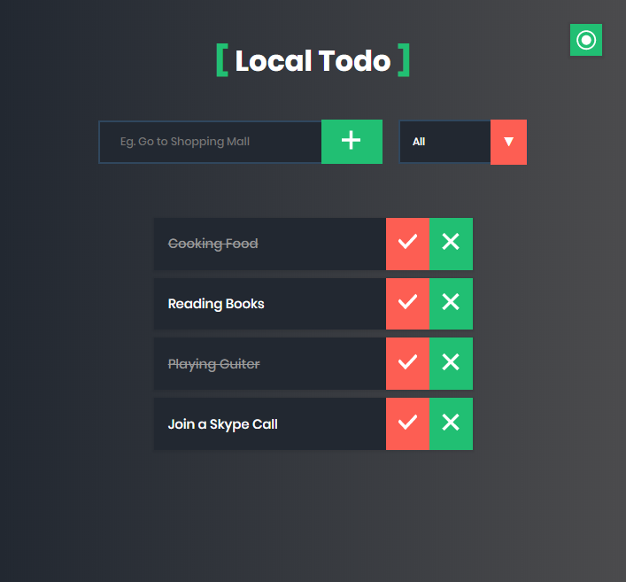

# :memo: Local Todo - A Basic Todo App with JS LocalStorage

**Local Todo** is a basic JavaScript app that uses Local Storage API to stores todo object data.
The app has some additional features like:

:pushpin: Filtering Todo using the drop down menu

:pushpin: Theme Switching (Light and Dark theme)

:pushpin: Toast Messages Notification (Broadcasting Info)

:pushpin: Animation and Many more.

You can extends :hammer_and_wrench: features like storing data to a database Using nodejs.

**Here are some screenshots:**

***Home Page:***

***Check Input Field (Basic):***

***Adding Task:***

***Checked Task:***

***Deleting all Todo:***

***Switching to Dark Theme:***

