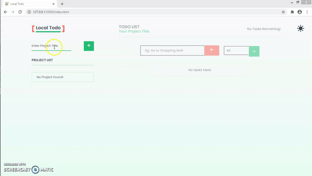

# :memo: Local Todo - A Basic Todo App with JS LocalStorage

**Local Todo** is a basic JavaScript app that uses Local Storage API to stores todo object data.
The app has some additional features like:

**App Features:**

- ✏️ Create Projects
- ✏️ Create Todo based on the Project
- ✏️ Toast Messages Notification
- ✏️ Storing Data with Local Storage
- ✏️ Filtering Todo using the drop down menu
- ✏️ Dark Mode and Many More.

## App Preview 😍

### 👉 [Live Link](local-todo.netlify.app)

