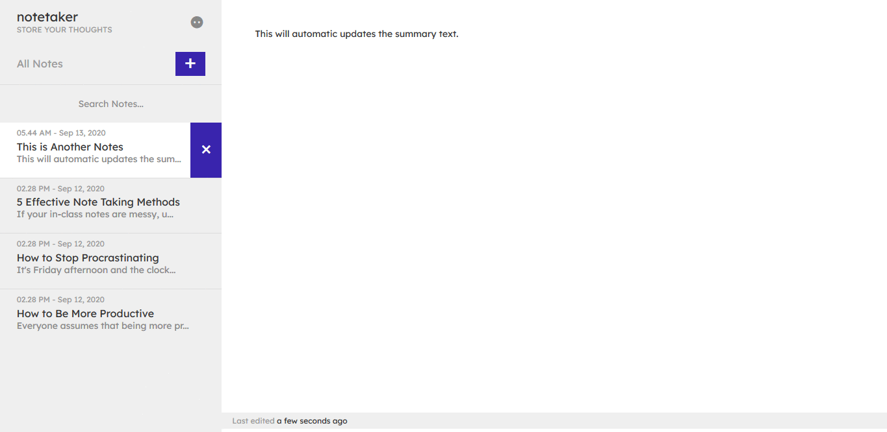

# 📝 Note Taker

The advanced note taker application built using JavaScript ES6 with local storage API.

**App Features:**

- ✏️ Create Notes on The Fly
- ✏️ Note Created Dates and Last Updated Status
- ✏️ Search Notes by Title
- ✏️ Storing Data with Local Storage
- ✏️ Multiple Browser Tab Sync
- ✏️ Dark Mode and Many More.

## App Preview 😍

### 👉 [Live Link](https://notetakerjs.netlify.app/)

